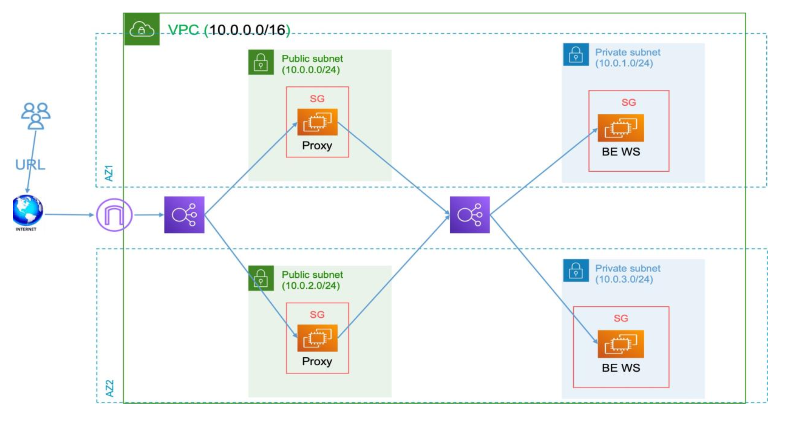

# Title
AWS Infrastructure with Terraform

## Overview
This project uses Terraform to deploy a scalable and secure architecture on AWS. The infrastructure supports a reverse proxy layer in public subnets and backend application servers in private subnets. The Terraform state is securely stored in an S3 bucket, with DynamoDB for state file locking to prevent conflicts during concurrent updates.

The setup includes user data scripts to automatically configure EC2 instances upon launch:

- Bastion Instances: Configured as reverse proxies using Nginx.
- Application Instances: Serve static content via Nginx.


## Architecture
The following diagram provides an overview of the architecture:


## File Structure

```
project/
├── docs/
│   └── architecture.png
├── modules/
│   ├── alb/
│   ├── ec2/
│   ├── keys/
│   ├── sg/
│   ├── subnet/
│   └── vpc/
├── userdata_files/
│   ├── application_userdata.tpl
│   └── bastion_userdata.tpl
├── .gitignore
├── .terraform.lock.hcl
├── alb.tf
├── backend.tf
├── ec2-and-sg.tf
├── keys.tf
├── provider.tf
├── README.md
├── subnet.tf
├── terraform.tfvars
├── variables.tf
└── vpc.tf

```

### Components

1. VPC (10.0.0.0/16):
    - Encompasses the entire infrastructure with both public and private subnets.

2. Public Subnets:

    - Proxy EC2 Instances (Bastion1 and Bastion2) are hosted here.
    - Connected to the Internet Gateway (IGW) for public internet access.

3. Private Subnets:

    - Backend Application Servers are hosted here.
    - Connected to NAT Gateways for secure, restricted outbound internet access.

4. Security Groups (SG):

    - Public SG allows SSH and HTTP access to the Proxy instances.
    - Private SG allows HTTP and SSH access between backend components.

5. Application Load Balancers:

    - Public ALB: Routes internet traffic to the Proxy EC2 instances.
    - Private ALB: Routes internal traffic to Backend Application Servers.

6. User Data Configuration:

    - Automates setup of Bastion and Application instances during launch.

7. Terraform S3 Backend:

    - Terraform state is stored in S3 for reliability and centralized state management.
    - DynamoDB is used for state locking to ensure safe updates in collaborative environments.

## Setup Instructions
### Prerequisites

1. Install AWS CLI and configure credentials.
2. Install Terraform.
3. Clone this repository from GitHub:

	```
    {
        git clone https://github.com/mhosnyamer/Secure-Web-Server-on-AWS.git
	    cd your-repository-name
    }

### Steps to Deploy
1. Initialize Terraform:

` terraform init`

2. Validate the configuration:

`terraform validate`

3. Generate a plan:

`terraform plan`

4. Apply the configuration:

`terraform apply`

5. Monitor the deployment using the AWS Console.


